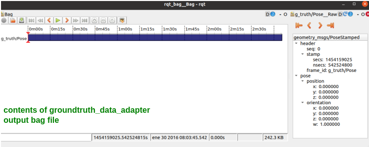
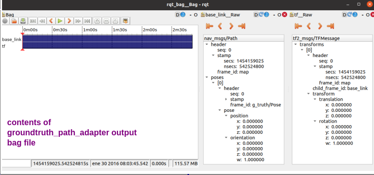
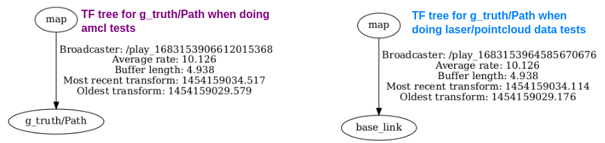
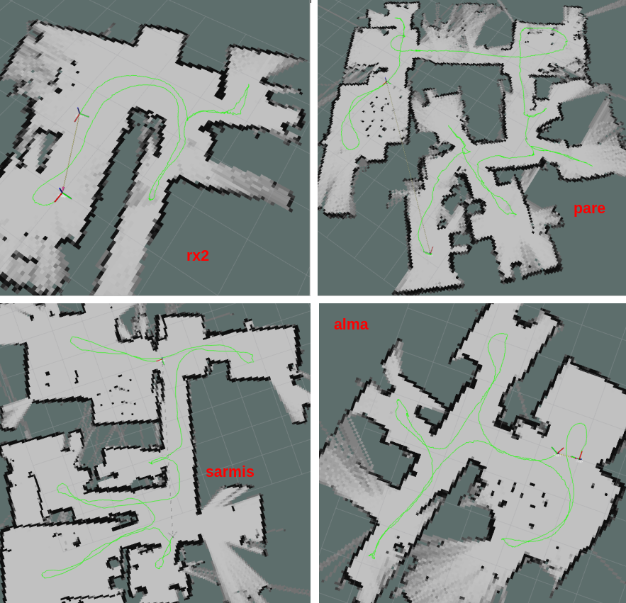

# GroundTruth Data Adapter

In the data section, there are 3 folders corresponding to the environments in the Robo@Home dataset: alma, pare and rx2. 
Inside each folder there are 2 files:

1.  log_estimated_path.txt
2.  hokuyo_processed.txt

The log_estimated_path.txt is the file provided by the Robo@Home that contains the recorded pose of the robot during trajectory, and as this
data is not timestamped the file hokuyo_processed.txt (which is the observation log for the laser scans of the same test) is used to extract the
timestamps. These files were previously analyzed to see that the number of readings in both files matched to avoid synchronization errors. This analysis is presented in the file:
Dataset_scenarios_logs_gtruth_match

The bag files with the groundtruth data can be compiled by running the groundtruth_data_adapter code. 
The generated files contain the groundtruth data provided in the Robo@Home dataset adapted to the ROS pose and path messages.There are two scripst in the source folder:

1. groundtruth_data_adapter.py
	
	This script compiles the pose message data needed to create the odometry data with the odom_data_adapter node. The output bag does not contain
	tf data or path message to visualize in rviz.
	
	
	To compile data the launch file needs to be modified with the name of the environment and the location of the 2 corresponding .txt files. Then run the following command:
		
		roslaunch groundtruth_data_adapter groundtruth_data_adapter.launch 
	
2. groundtruth_path_adapter.py
	
	This script compiles the path and tf messages needed to visualize the groundtruth path in rviz. The tf data can be changed by modifying lines 93, 97 of the code.
	 In the example below two bags were compiled: one with tf data from map to base_link to test laser data in rviz and the second one with tf data from map to gtruth/Path to 
	 visualize the groundtruth when running the amcl. 
	
	
	
	To compile the data the launch file needs to be modified with the name of the environment and the location of the 2 corresponding .txt files. Then run the following command:
		
		roslaunch groundtruth_data_adapter groundtruth_path_adapter.launch 

For more specific details on the groundtruth_data_adapter please refer to section 5.3 of [file](https://github.com/fernandaroeg/ROS_AMCL_Hybrid_Localization/blob/master/TFM_Localizacion_Rodriguez_Fernanda.pdf)

To visualize the data in rviz launch the map and play the groundtruth path bag using the command:

	rosbag play groundtruth_path_scenario.bag 
	
Visualize in rviz the groundtruth path by selecting /map as fixed frame and adding Path and TF visualization. 

To inspect the contents of the bag files run the following command in the location where the bag files are located: 

	rqt_bag filename 

