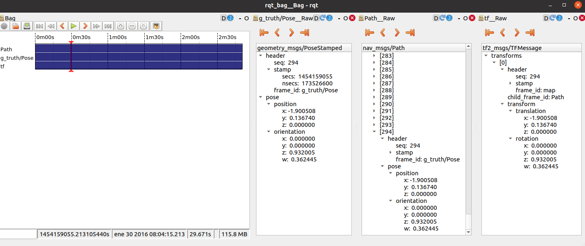

# GroundTruth Data Adapter

In the data section, there are four folders corresponding to the environments in the Robo@Home dataset: alma, pare, rx2 and sarmis. 
Inside each folder there are 2 files:

1.  log_estimated_path.txt
2.  hokuyo_processed.txt

The log_estimated_path.txt is the file provided by the Robo@Home that contains the recorded pose of the robot during trajectory, and as this
data is not timestamped the file hokuyo_processed.txt (which is the observation log for the laser scans of the same test) is used to extract the
timestamps. These files were previously analyzed to see that the number of readings matched, this analysis is presented in the file:
Dataset_scenarios_logs_gtruth_match

The bag files can be compiled by running the groundtruth_data_adapter code. The launch file needs to be modified with the name of the 
environment and the location of the 2 corresponding .txt files. 

The generated bag contains the groundtruth data provided in the Robo@Home dataset adapted to the ROS pose message.
The bag file also contains the path message of the groundtruth data and the required TF data from the map to the path to visualize the groundtruth data
graphically in Rviz. 

Visualize in rviz the groundtruth path and TF selecting /map as fixed frame and adding Path and TF visualization. 

By running the command in the location where the bag files are located: 

	rqt_bag file name 

It is possible to inspect the contents of the bag files. 

