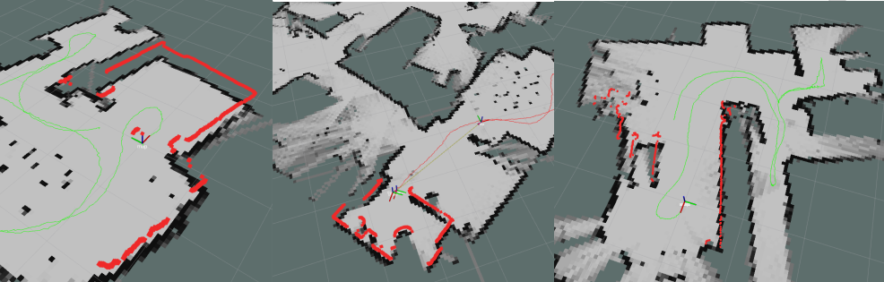
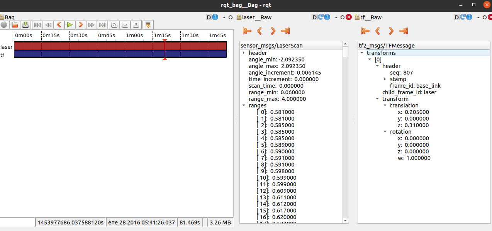

# Laser Data Adapter

In the data section, there are 3 folders corresponding to the environments in the Robo@Home dataset: alma, pare and rx2. 
Inside each folder there is a set of files with the laser readings and a log file with the timestamps for each laser reading:

1.  1_hokuyo_processed (folder with laser readings)
2.  1_hokuyo_processed.txt

The name of these files along with the environment name have to be configured in the launch file in order to compile the bag with the 
laser data.

	roslaunch laser_data_adapter compile_laser_data.launch

The generated bag contains the laser data provided in the Robo@Home dataset adapted to the ROS laser message and the required TF data 
from the base_link to the laser. To visualize the laser data graphically in Rviz you will need to play it along with the AMCL node and odom bag to avoid
having TF errors or re-compile the laser bag file changing the line 114 in laser_data_adapter_node.py to set the parent frame of the laser to another existing
frame. For more specific details on the laser_data_adapter please refer to section 5.2 of [file](https://github.com/fernandaroeg/ROS_AMCL_Hybrid_Localization/blob/master/TFM_Localizacion_Rodriguez_Fernanda.pdf)

Visualization in rviz of the laser data for the environments alma, pare and rx2: 

By running the command in the location where the bag files are located: 

	rqt_bag filename 

It is possible to inspect the contents of the bag files. 

