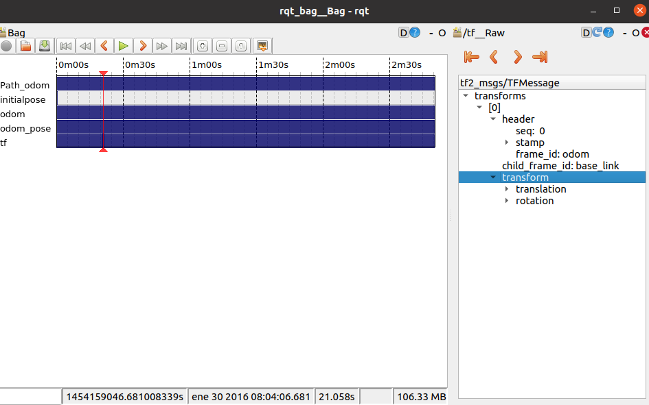
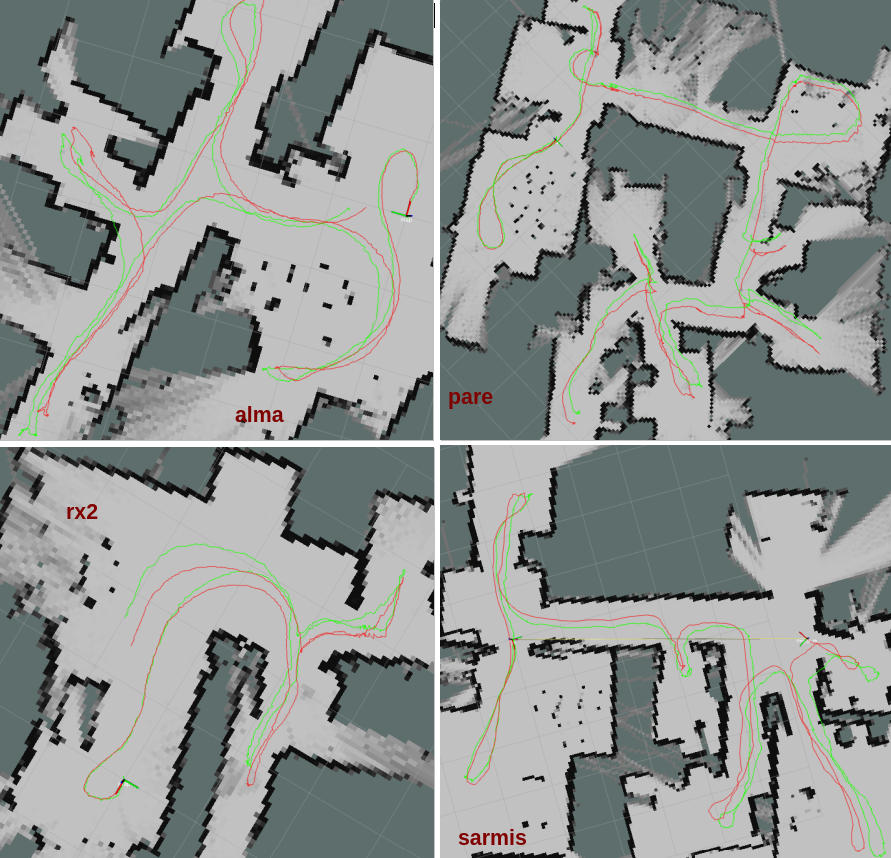
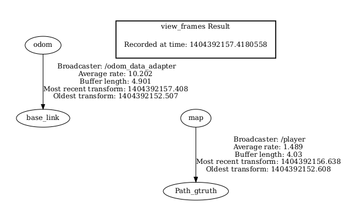

# Odom Data Adapter

This node subscribes to the topic "g_truth/Pose" previously recorded in a bag file using the groundtruth_adapter code. It adds noise to the 
groundtruth data in order to simulate odometry noise. The node publishes the following topics: 

* **odom:** Ros odometry message containing pose, pose covariance and twist

* **Path_odom:** Ros path message to visualize graphically the odom path in Rviz
 
* **initialpose:** Initial pose of the robot which is injected with a noise value related to the one injected to the odometry. This value is 
used by the amcl node to reduce error in the path estimation.
 
* **odom_pose:** the pose stamped of the generated odometry
 
* **tf:** tf value with the relation between odometry and the base_link of the robot  
	
In order to run this node the launch file test_odom.launch has to be edited with the desired noise levels and location of the groundtruth pose bag file and the
 map server has to be launched previously.

	roslaunch odometry_data_adapter test_odom.launch
	
The launch file records a bag file with all the relevant topics that will be needed to run and test the amcl.

If the groundtruth bag file is not set in the launch file and instead played by terminal please note that it is important to use the clock flag for the odom 
node to work properly.

	rosbag play --clock groundtruth_file.bag 

For each of the environments of the Robo@Home dataset 5 odom bag files were created with the following noise levels:
	
1. odom1: no noise
2. odom2: 0.5cm in x
3. odom3: 0.5 cm in y
4. odom4: 0.1° in theta
5. odom5: 0.5cm in x, 0.5 cm in y and 0.1 rad in theta

The noise levels to be set in the launch file are expressed in meters for x and y and in radians for theta. The variance of the noise value is used
 in the code so the values in the launch file must be the value of desired noise expressed in the correct unit and squared, for example:

x: 0.5cm, expressed in m is 0.005m, and the value squared is 0.000025var 

y: 0.5cm, expressed in m is 0.005m, and the value squared is 0.000025var 
				
theta: 0.1°, expressed in rad is 0.0017rad, and the value squared is 0.000003var 

So the noise values for 0.5cm in x,y and 0.1° in theta must be set in the launch file as 0.000025 for x,y and 0.000003 for theta

The data published by this node can be recorded in bag files by using the command
	
	rosbag record topics /odom /initialpose /Path_odom /odom_pose /tf

The image of the generated odom path with noise in x, y and theta for all environments can be seen in:

The red path represents the groundtruth and the green path the odom path with noise injected

The tf tree for the generated data looks like:

The tf between odom and map is not set as this value will be eventually published by the amcl node. 

