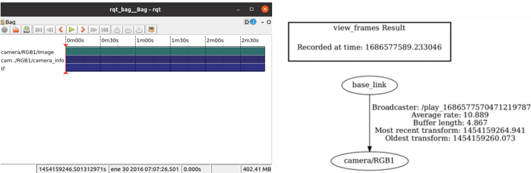
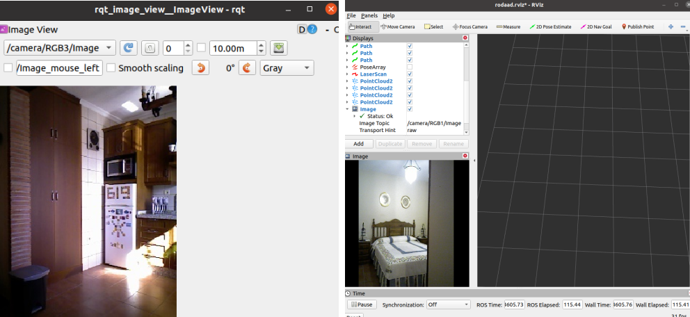
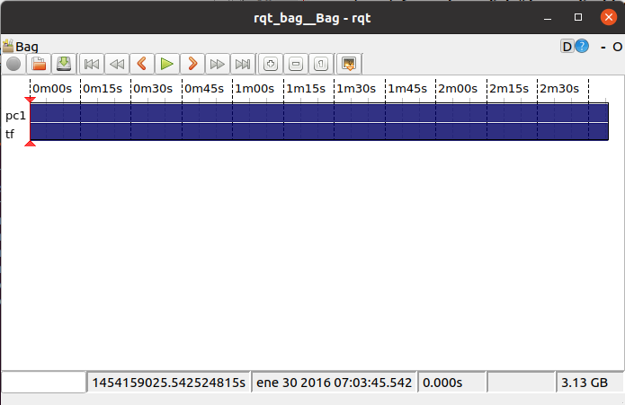
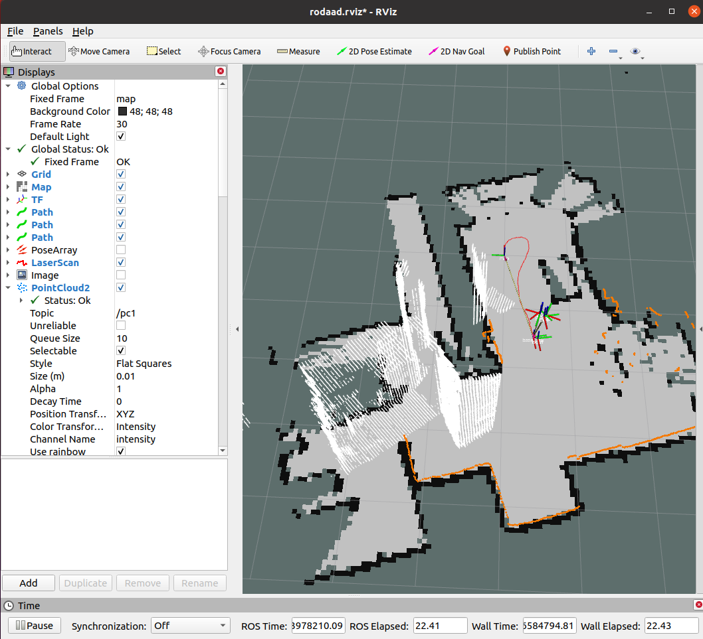
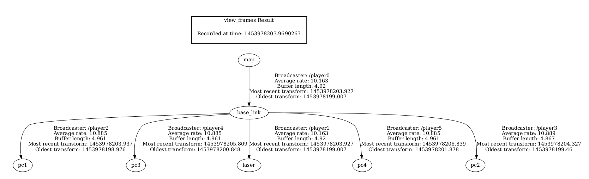
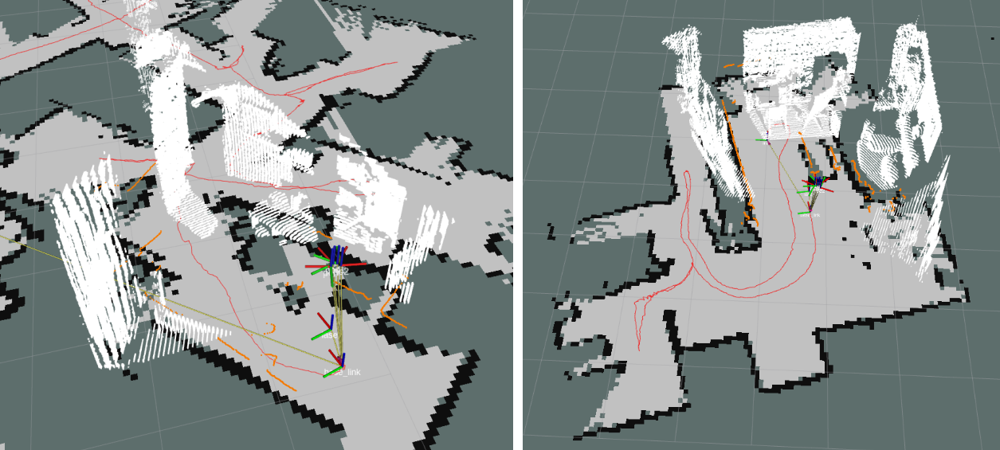
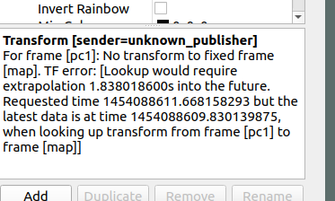

# RGB-D Data Adapter

In the data section, there is a folder with a set of png files with the RGB and Depth images taken from the fullhouse trajectory of the robot in the scenarios.
There is also a log file with the timestamps for each reading:

1.  fullhouse1_rgbd (folder with images)
2.  fullhouse1_rgbd.txt

## Image
The images from the 4 RGB-D cameras can be compiled by running the launch file "compile_rgbd_img.launch".
In this file 4  parameters have to be set:
1. environment: alma, pare, rx2
2. rgbd_raw_path: path to the folder with the png images
3. tstamp_file: path to the file with the timestamps
4. img_type: type of image to be compiled, "intensity" for colored images or "depth" for grayscale depth images.

The CameraInfo is specified in the source code "rgbd_data_adapter_img.py" with values taken from the dataset
Robo@Home.  The launch file can be run with the command: 

	roslaunch rgbd_data_adapter compile_rgbd_img.launch
	
The output is 4 bag files corresponding to each one of the cameras.
In the following image it can be seen in the left, the content in each bag file with the topics tf, cameraInfo and image,
 and in the right the tf tree corresponding to this data. 

The image data can be visualized either in rviz or using the rqt_image_view tool.

## PointCloud
To compile the pointcloud data from the depth images, the launch file "compile_rgbd_pc.launch" can be run by configuring
the following parameters:
1. environment: alma, pare, rx2
2. rgbd_raw_path: path to the folder with the png images
3. tstamp_file: path to the file with the timestamps
The command to run the launch file is: 

	roslaunch rgbd_data_adapter compile_rgbd_pc.launch

The output is 4 bag files with the pointcloud data corresponding to each one of the cameras. 

To visualize and test the data it is necesary to run the pointcloud data with the complete TF tree. The launch file
"test_pc_data.launch" can be run to launch and visualize all the relevant data in rviz.

For more specific details on the rgbd_data_adapter please refer to section 5.5 of 
[file](https://github.com/fernandaroeg/ROS_AMCL_Hybrid_Localization/blob/master/TFM_Localizacion_Rodriguez_Fernanda.pdf)

Visualization in rviz of the rgbd data for the environments pare and rx2: 

## Synchronization Problems
When running the pointcloud data it is possible to encounter some synchronization problems. In the image below an Rviz error message
is shown where it states that there is a time difference between the pc data and the rest of the data.

This error can be fixed by modifying the timestamps of the RGB-D data or by adding a delay, of the amount of time written in the Rviz error, in the launch file where the pointcloud data
is played, by using the sleep command:

		<node name="player3" pkg="rosbag" type="play" output="screen" args=" $(arg path)$(arg file3).bag" launch-prefix="bash -c 'sleep 0.4; $0 $@' " />
